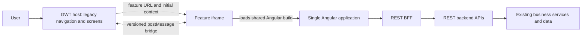
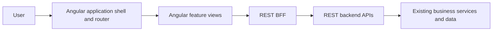

# GWT-to-Angular Migration Strategy

## Purpose

This document describes a gradual migration from a large GWT application to a single Angular application. It is intended for teams that need to modernize many user-interface areas while keeping the existing GWT application operational during the transition.

The strategy assumes that:

- GWT currently owns the application container, navigation, and a substantial set of screens.
- Angular will be one application and one codebase containing many feature views, not a separately deployed Angular application for every screen.
- During the hybrid period, GWT can host Angular views in iframes.
- The server-side business rules and data remain in place; the browser-facing integration moves toward REST APIs exposed through a Backend-for-Frontend (BFF).
- The target is to remove GWT when both its client responsibilities and any required GWT-RPC capabilities have been replaced.

## Recommendation

Use the existing iframe boundary as a controlled migration mechanism, not as the final application architecture. Keep one Angular build and deployment. Let the GWT host select and open an Angular feature view in an iframe while that feature is being migrated. Keep communication with the host behind a small, versioned integration adapter so the feature itself does not depend on GWT or on running inside an iframe.

Once enough functionality has moved, replace the GWT container with an Angular shell. Mount the same feature views through Angular routing and composition, without iframes. Retire the GWT client and GWT server as separate activities: the server can only be removed after all required GWT-RPC operations have been replaced and their usage has stopped.

This approach avoids a large, high-risk rewrite up front while also avoiding a permanent design in which every feature becomes its own Angular application. It does not assume that all iframe boundaries should disappear on day one; it makes them explicit and removable.

## Target and Transition Architectures

During migration, there is one Angular artifact but potentially several Angular runtime instances. Every iframe is a separate browser document with its own Angular bootstrap, in-memory state, router, and lifecycle. The browser may cache the shared assets, but those runtime instances do not share a JavaScript heap.

The final browser experience has an Angular-owned shell and directly composed feature views:

The architectural change at the end is primarily a change in composition and ownership of navigation. It should not require rebuilding each feature if features have been kept independent of the iframe bridge.

## Migration Phases

### 1. Discover the journeys and establish the design direction

Inventory user-visible capabilities rather than only counting screens. Record the main journeys, entry points, actions, validation rules, status changes, error cases, shared data, and dependencies between features. Where the legacy application is organized into tabs and subtabs, use a tab or subtab as the initial candidate boundary for a feature and its migration tests. Confirm that it contains a coherent user flow: if a journey routinely crosses tabs or subtabs, treat the smallest set that completes that journey as the boundary instead of splitting it artificially.

Define a lightweight Angular design system before scaling implementation. It should cover the application shell, navigation, typography, spacing, forms, tables, dialogs, notifications, loading and error states, responsive behavior, and accessibility. Preserve familiar workflows where that reduces user disruption, while giving migrated views a consistent Angular visual language.

Prototype representative journeys, including a list-to-detail flow and a create-or-edit flow, and validate their layout and navigation before using them as patterns for additional cohorts.

**Exit criteria:** the feature inventory and dependency map are reviewed; the initial design patterns and navigation model are accepted; the first migration cohort is selected.

### 2. Shape the single Angular application for both hosting modes

Organize the Angular codebase around a shared application foundation and feature areas. A feature should have a stable identity and a defined set of routes or views. Avoid generating a distinct application, deployment, or independently versioned bundle for each iframe.

Define how the GWT host selects an Angular view. For example, it can open a stable Angular entry URL containing a feature identifier and only the minimal non-sensitive context needed to initialize that view. The Angular entry point resolves that identifier to a known route or feature. Choose a routing and URL strategy that works for iframe loads, refreshes, direct links, and later standalone navigation.

Keep environment configuration, base paths, asset URLs, authentication/session behavior, and cache policy consistent between embedded and standalone operation. Prefer same-origin hosting or a deliberate reverse-proxy arrangement when that simplifies cookies and browser security. Do not put secrets or sensitive business data in query strings.

**Exit criteria:** the same Angular build can open at least one feature view in an iframe and as a direct Angular route; refresh and direct navigation behave predictably in both modes.

### 3. Define and isolate the GWT-to-Angular bridge

Treat the iframe as an integration boundary with an explicit contract. Keep the bridge in an Angular adapter/service and a corresponding host-side integration layer. Feature components should communicate with application services, not call `window.parent` or know which host launched them.

A practical lifecycle contract includes:

- **Initialization:** a feature identifier, a correlation/session identifier, and a small, validated context payload.
- **Ready:** Angular reports that the requested view has initialized, allowing the host to end its loading state.
- **Resize:** Angular reports content-size changes when the host needs to size the iframe. Use a resize observer and avoid unbounded resize feedback loops.
- **Completion and cancellation:** a feature reports successful completion or user cancellation so the host can close a modal, refresh data, or navigate appropriately.
- **Error:** initialization and operation failures are reported in a controlled, user-safe form.
- **Teardown:** host navigation or iframe removal releases listeners, subscriptions, and other resources.

For `postMessage`, specify a protocol version and message schema. Send messages to an exact target origin rather than `*`; validate the sender origin, schema, protocol version, and session/correlation identifier on receipt. Handle duplicate, late, malformed, and out-of-order messages. The host bridge is temporary; the feature behavior and business operations are not.

**Exit criteria:** a pilot feature has reliable initialization, completion/cancel/error handling, sizing, and teardown; invalid or stale messages are rejected; bridge code is isolated from the feature implementation.

### 4. Establish REST BFF coverage for Angular

Angular should call the frontend server's REST BFF rather than GWT-RPC or backend services directly. The BFF provides a browser-facing contract and forwards requests to REST backend APIs. Preserve the existing business logic and data ownership; expose the required capabilities without duplicating business rules in Angular or the BFF.

Create a capability-to-API map. For each operation, document request/response shapes, validation behavior, authorization/session requirements, error semantics, and any state transition. Compare these with current user-visible behavior so API conversion does not silently change the workflow.

Some legacy systems may have a REST BFF that currently delegates to a non-REST protocol. Treat REST backend availability or a server-side adapter as an explicit dependency. A transport adaptation should not require changing the business rules, but it does need its own verification and operational ownership.

This work can proceed in parallel with Angular shell and bridge development. A feature cohort is not ready to migrate until the REST capabilities it needs are available and tested.

**Exit criteria:** every operation required by the cohort has a documented REST contract through the BFF; error and validation behavior is verified; Angular does not bypass the BFF.

### 5. Prove the approach with a pilot, then migrate by cohorts

Choose a pilot that exercises the important integration patterns without requiring a broad rewrite. Use it to validate the design system, iframe entry contract, bridge lifecycle, API access, deployment, observability, and end-to-end test approach.

For each later cohort:

1. Confirm the tab/subtab boundary, journeys, and dependencies in scope. Expand the boundary if a normal user journey depends on adjacent areas.
2. Before changing the flow, assess its automated coverage. If Playwright tests are missing or too sparse to protect the important behavior, add the missing user-journey tests against the existing GWT implementation first. Run them and record a stable baseline before changing the flow; ensure the test data and environment are repeatable.
3. Implement the feature views using shared Angular patterns and services, then connect them to the required REST BFF operations.
4. Have GWT load the view from the shared Angular application, passing only the required context.
5. Run the same Playwright flow scenarios against the Angular implementation in its GWT-hosted iframe. Compare observable behavior with the baseline, including success, validation, cancellation, and error paths that are in scope. Keep the scenarios and assertions shared; use small locator or host adapters only where the GWT and Angular DOM or iframe boundary necessarily differ.
6. Switch the relevant host entry point to Angular and retain a rollback path until the cohort is stable.
7. Remove the replaced GWT screen and its feature-specific integration only after the same tests pass and adoption and regression criteria are met.

Treat this as a flow-level migration gate, repeated for each tab/subtab or larger journey boundary, not as a one-time test pass at the end of the program. Preserve the baseline tests and results while the old and new versions coexist. Update expectations only for explicitly approved behavior changes; do not weaken or rewrite a test simply to make the Angular implementation pass.

Order cohorts by user value, dependency readiness, reuse, and risk. Do not optimize only for the number of screens migrated. Where many iframes can be active concurrently, measure memory, startup time, and duplicate runtime costs; a shared build does not make iframe instances share runtime state. Lazy loading, asset caching, and limiting simultaneously active frames may help, but validate these against real usage patterns.

**Exit criteria:** all in-scope journeys in the cohort work through Angular and REST; host integration is stable; parity and regression tests pass; rollback is understood; the replaced GWT path is no longer required.

### Playwright as a per-flow migration gate

Playwright coverage is a migration safety mechanism, not merely a final quality check. Apply the following policy to every tab, subtab, or larger cross-area journey selected for migration:

1. **Assess coverage before implementation.** List the important user-visible outcomes and failure paths for the selected boundary. If no Playwright coverage exists, add it against the current GWT flow before migration. If coverage exists but misses critical actions or states, extend it before migration. Do not start the UI replacement with an unverified baseline.
2. **Establish a trustworthy GWT baseline.** Run the tests against the current GWT experience and resolve test instability, test-data leakage, and environment issues. Record the passing baseline and any known, explicitly accepted defects so the migration does not accidentally redefine expected behavior.
3. **Run the same scenarios against Angular.** After the Angular flow is hosted in the GWT iframe, execute the same user-level scenarios and compare outcomes. Prefer accessible roles, names, and visible behavior over selectors tied to framework-generated markup. Where DOM structure differs, keep a small locator adapter while retaining the same scenario and business assertions.
4. **Gate the host switch and GWT retirement.** Switch the relevant tab/subtab to Angular only when its required scenarios pass, with any behavior differences explicitly approved. During coexistence, continue running GWT regression tests for flows that remain GWT and Angular tests for migrated flows. Once a GWT flow is removed, its behavior scenarios remain in the Angular regression suite; do not keep a duplicate test job for a retired implementation without a specific reason.

The default recommendation is therefore **test on both implementations during migration, but share the user-journey specification and avoid maintaining duplicate test logic**. Add or extend Playwright tests on GWT first when needed to establish the baseline; then run those scenarios against Angular. Angular unit and component tests should be added for Angular-specific logic and states, but they complement rather than replace the Playwright journey gate. Do not invest in broad new GWT unit tests for code scheduled for removal; add enough GWT-side Playwright coverage to make the before/after comparison reliable.

Tab and subtab boundaries are useful starting points, not an automatic guarantee of test completeness. Include a cross-tab scenario when a normal user journey enters or leaves the selected area. The migration boundary and test boundary should cover the same coherent journey.

**Per-flow gate:** GWT Playwright baseline passes before changes; required outcomes and test data are documented; the same scenarios pass against Angular in the iframe; approved differences are recorded; only then switch the host entry point and retire the old flow.

### 6. Replace the GWT container with the Angular shell

Plan the eventual shell early, even if it is not delivered until most feature cohorts have migrated. This prevents the iframe-oriented pilot layout from becoming the permanent design.

The Angular shell takes ownership of global navigation, layout, route handling, shared context, and cross-feature coordination. Mount existing feature views through Angular routes or component composition rather than loading the Angular application inside itself through iframes. Reuse the feature code; remove iframe-specific behavior by disabling or removing the bridge adapter in standalone mode.

If a small number of GWT areas remain, expose them behind a deliberately temporary legacy boundary with a clear owner and retirement condition. Avoid nested iframes and avoid maintaining competing global navigation models longer than necessary.

**Exit criteria:** Angular owns the user entry point and global navigation; required feature journeys are directly composed; deep links, refresh, browser history, authentication/session, and error handling have been verified without relying on GWT.

### 7. Retire the GWT client and server separately

Retire the **GWT client** only after no required screen, navigation path, application startup, or Angular integration depends on it. Remove the host-side iframe launchers and bridge endpoints as their corresponding cohorts are absorbed into Angular.

Retire the **GWT server/RPC layer** only after required operations have been moved behind REST BFF contracts and telemetry or usage checks show no remaining GWT-RPC consumers. Preserve business services and data access that remain necessary; remove only GWT-specific transport, serialization, servlet, and client/server code that is no longer used. Shared Java code must be assessed by responsibility, not deleted simply because it resides near GWT code.

**Exit criteria:** no active GWT client entry points or iframe launch paths remain; GWT-RPC traffic is absent for an agreed observation period; all required capabilities have supported REST paths; deployment, monitoring, support, and rollback procedures no longer require GWT.

## Cross-Cutting Design and Delivery Practices

- **Design consistency:** maintain shared tokens and reusable patterns, but allow feature-specific layouts when user tasks require them. Match the familiar interaction model where useful; do not reproduce legacy limitations just for visual parity.
- **Accessibility:** verify keyboard navigation, focus entry and return across dialogs/iframes, accessible names, validation feedback, and zoom/responsive behavior. An iframe boundary can complicate focus management and should be included in pilot testing.
- **Observability:** record feature identity, Angular build version, host/bridge protocol version, initialization failures, API failures, and cohort adoption without logging sensitive context. This makes it possible to identify residual legacy usage before decommissioning.
- **Release and rollback:** deploy the shared Angular artifact independently of when each GWT entry point is switched. Use controlled routing/configuration where appropriate so a cohort can be returned to its legacy path during rollout.
- **Testing:** maintain GWT regression coverage for areas not yet migrated, and Angular regression coverage for migrated areas. Add iframe bridge tests and direct-route tests for standalone Angular operation. Keep the per-flow GWT-before/Angular-after Playwright gate described above; Angular unit/component tests supplement, but do not substitute for, user-journey coverage.
- **Security:** treat iframe messages and initialization context as untrusted input. Apply explicit origin checks, payload validation, authorization on the server, and an appropriate content security policy. Do not rely on hiding a GWT menu item as authorization.

## Key Risks and Mitigations

| Risk | Mitigation |
| --- | --- |
| Each iframe creates an independent Angular runtime and state store | Keep cross-feature state in server APIs or explicit host context; measure concurrent iframe resource use; avoid assuming a shared browser runtime. |
| Feature code becomes coupled to the GWT parent | Isolate host communication behind an adapter; test the same feature through direct Angular routing. |
| URLs, refresh, or browser history break in embedded mode | Define stable feature URLs and routing rules early; test deep links and refresh before scaling. |
| Host and iframe disagree about lifecycle or message shape | Version the bridge contract; validate messages; test stale sessions, duplicate messages, timeouts, and teardown. |
| REST migration changes business behavior | Map old capabilities and error semantics to BFF contracts; keep business rules in the existing server-side services; compare end-to-end outcomes. |
| GWT server is removed while consumers remain | Track GWT-RPC usage and dependencies; remove client and server in separate, evidence-based steps. |
| Hybrid navigation feels inconsistent | Define the final Angular shell and design system early; make each cohort's host-to-feature navigation explicit and predictable. |
| A tab/subtab is migrated even though its user journey crosses other areas | Use tabs/subtabs as candidate boundaries, then validate them against observed journeys and dependencies; expand the test and migration boundary where needed. |
| Before/after tests give misleading results or coverage is inadequate | Add missing Playwright scenarios against GWT before migration, stabilize test data and environment, share journey assertions across implementations, and document approved behavior changes separately. |

## Completion Checklist

- [ ] One Angular codebase/build/deployment contains all migrated feature views.
- [ ] Every migrated view works both in the GWT-hosted iframe mode and directly in Angular.
- [ ] The GWT bridge is isolated, versioned, origin-checked, and removable.
- [ ] Angular uses REST BFF APIs; business rules and data ownership remain server-side.
- [ ] Migration cohorts have journey-level parity, integration tests, and rollback criteria.
- [ ] Every migrated tab/subtab or cross-area flow has adequate Playwright coverage, a recorded GWT baseline, and passing Angular parity scenarios in the iframe.
- [ ] During coexistence, GWT tests cover unmigrated journeys and Angular tests cover migrated journeys; retired GWT flows are not needlessly maintained as duplicate test jobs.
- [ ] Angular owns the final shell, navigation, URLs, and cross-feature composition.
- [ ] No required screens or entry points depend on the GWT client.
- [ ] No required capability or active consumer depends on GWT-RPC before server retirement.
- [ ] Operational monitoring and support no longer require GWT-specific infrastructure.